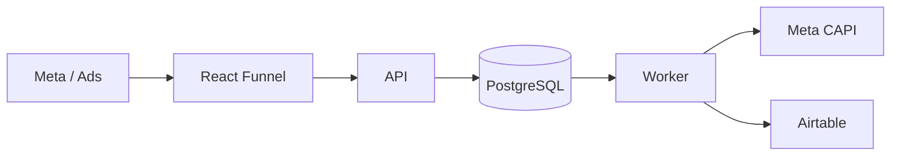

# Growth Funnel System

A small, production-minded lead-generation system: a mobile-first React qualification
funnel, a Fastify API, PostgreSQL as the system of record, and a hand-rolled
Postgres-backed job queue that reliably delivers each lead to Meta (Conversions API)
and Airtable — independently, with retries, backoff, and dead-letter recovery.

Built as a take-home exercise. The brief: demonstrate conversion UX, attribution
integrity, Meta event quality/deduplication, and a lead pipeline that cannot lose a
lead because a downstream integration is down.

## Overview

```text
Acquisition → React funnel → Lead capture → Attribution → API → PostgreSQL
                                                              → background worker
                                                                  ├── Meta Conversions API
                                                                  └── Airtable
```

PostgreSQL is the only system of record. The API's job is to validate, normalize, and
durably persist a lead plus two pending jobs in one transaction, then respond
immediately — it never waits on Meta or Airtable. The worker polls for jobs, claims
them atomically, and retries each integration independently with exponential backoff,
so a Meta outage can never block or lose an Airtable sync (or vice versa), and neither
can ever lose the lead itself.

## Architecture



```text
apps/
  web/        React + Vite + TS + Tailwind — the qualification funnel
  api/        Fastify API — validates, persists, enqueues jobs, never calls
              Meta/Airtable directly
worker/       Independent process — polls, claims, and processes jobs
packages/
  shared/     Types + funnel config + normalization shared by web/api/worker
  validation/ Zod schemas — the only place request shape is defined
prisma/       schema.prisma + migrations (leads, events, jobs, idempotency_keys,
              worker_heartbeat)
```

## Local setup

Requires Node 20+ and a PostgreSQL instance (Docker, a native install, or a free
hosted instance — only `DATABASE_URL` matters; nothing in the code branches on
environment).

```bash
cp .env.example .env            # fill in DATABASE_URL at minimum
docker compose up -d            # starts Postgres on localhost:5432
npm install
npm run prisma:migrate          # creates the schema
npm run dev:api                 # terminal 1 — http://localhost:4000
npm run dev:worker              # terminal 2
npm run dev:web                 # terminal 3 — http://localhost:5173
```

With `META_ENABLED=false` and `AIRTABLE_ENABLED=false` (the `.env.example` default),
the whole pipeline runs with zero external credentials: the funnel submits, the API
persists the lead and creates both jobs, and the worker "sends" each one — constructing
the real request payload and logging it as a mock send rather than skipping the
integration entirely. This is not a stub: swapping `META_ENABLED=true` and supplying
real credentials sends the identical payload for real, no code change required.

## Environment variables

| Variable | Purpose |
|---|---|
| `DATABASE_URL` | Postgres connection string. The only thing that differs between local and deployed — see "Deployment". |
| `API_PORT` | Port the Fastify API listens on. |
| `WEB_ORIGIN` | CORS allow-list for the API — a single origin or a comma-separated list. Never `*`. |
| `NODE_ENV` | `development` / `test` / `production`. Refuses to boot in `production` if either `*_SIMULATE_FAILURE` flag is set. |
| `LOG_LEVEL` | pino log level. |
| `META_ENABLED` | `false` runs Meta CAPI in mock mode (builds the real payload, logs it, doesn't send). |
| `META_PIXEL_ID` / `META_ACCESS_TOKEN` / `META_TEST_EVENT_CODE` | Server-side CAPI credentials. Never reach the browser. |
| `META_SIMULATE_FAILURE` | Dev-only — forces every Meta send to throw, to demo retries. |
| `AIRTABLE_ENABLED` / `AIRTABLE_API_KEY` / `AIRTABLE_BASE_ID` / `AIRTABLE_TABLE_ID` | Airtable sync credentials, same mock-mode pattern. |
| `AIRTABLE_SIMULATE_FAILURE` | Dev-only — forces every Airtable sync to throw. |
| `MAX_JOB_ATTEMPTS` | Snapshotted onto each job at creation time — changing it later doesn't retroactively change already-enqueued jobs. |
| `JOB_POLL_INTERVAL_MS` | Worker's idle poll interval. |
| `JOB_LEASE_TIMEOUT_MS` | How long a claimed job stays locked before being considered crashed and eligible for another worker. |
| `PRIVACY_POLICY_VERSION` | Stamped onto every lead's consent record. |
| `VITE_API_URL` | The funnel's API base URL. Never hardcoded in the frontend. |
| `VITE_META_PIXEL_ID` | Public Pixel ID for the browser Pixel (safe to expose — it's not a secret). |
| `VITE_PRIVACY_POLICY_VERSION` | Must match the API's `PRIVACY_POLICY_VERSION`. |

## Database

Prisma owns the schema (`prisma/schema.prisma`) and migrations
(`prisma/migrations/`). Four tables plus a tiny heartbeat singleton:

- **leads** — the lead, its qualification answers, and its first-touch attribution.
- **events** — the canonical `Lead` conversion's `event_id`, status, and send history.
- **jobs** — the job queue: type, status, attempts, lease, and backoff schedule.
- **idempotency_keys** — one row per accepted `POST /api/leads` request, keyed by the
  client's `Idempotency-Key` header.
- **worker_heartbeat** — a single row the worker touches every poll cycle, so
  `/admin/health` can report real worker liveness without a direct channel between
  the two processes.

```bash
npm run prisma:migrate   # local dev — creates a new migration from schema changes
npm run prisma:deploy    # CI/production — applies existing migrations only
```

The hosted (production) database is initialized from `prisma migrate deploy` against
the committed migrations only — never from a local dump, and never manually.

**Every `DateTime` column is `@db.Timestamptz(3)`, deliberately.** The worker's job
claim uses raw SQL comparing a column against Postgres's `now()`. Postgres's default
`timestamp without time zone` silently reinterprets that comparison in the session's
timezone instead of comparing absolute instants — on a server not configured for UTC,
that mismatch defeats backoff entirely (a job scheduled 2 minutes out gets reclaimed
immediately). This was caught by actually running the retry path locally, not by
reading the Prisma docs — see "Known limitations".

## Worker

A single dedicated process, independent of the API, started with `npm run dev:worker`
(or `node dist/worker.js` in production — a separate deployed service, not a thread
inside the API).

Each poll cycle:

1. **Heartbeat** — upserts `worker_heartbeat.updated_at`.
2. **Atomic claim** — one SQL statement:
   ```sql
   UPDATE jobs SET status = 'processing', attempts = attempts + 1, ...
   WHERE id = (
     SELECT id FROM jobs
     WHERE (status = 'pending' AND available_at <= now())
        OR (status = 'processing' AND lease_expires_at < now())
     ORDER BY available_at ASC
     FOR UPDATE SKIP LOCKED
     LIMIT 1
   )
   RETURNING *;
   ```
   `FOR UPDATE SKIP LOCKED` inside the sub-select means two workers racing this query
   can never claim the same row — the loser skips past the locked row instead of
   blocking or double-claiming. The lock-and-update happen in one statement, so there's
   no gap for a second worker to race into.
3. **Dispatch** by `job_type` to the Meta or Airtable handler.
4. **On success** → `completed`. **On failure** → exponential backoff
   (5s / 30s / 2m / 10m, then doubling, capped at 1 hour) until `max_attempts`
   (snapshotted per-job at creation), then `dead_letter`.
5. **Crash recovery** — a job stuck in `processing` whose `lease_expires_at` has
   passed (the worker that claimed it crashed or was killed) is picked up by the next
   poll exactly like a fresh `pending` job.
6. **Graceful shutdown** — on `SIGTERM`/`SIGINT`, the loop stops claiming new jobs,
   awaits whatever job is already in flight, then disconnects Prisma and exits.

Dead-letter jobs are visible at `GET /admin/health` and recoverable two ways:

```bash
curl -X POST http://localhost:4000/admin/jobs/<jobId>/requeue
# or, from the worker package:
npm run requeue --workspace worker -- <jobId>
```

Requeuing resets `status`/`attempts`/the lease and lets the worker retry it. This is
safe specifically because both downstream syncs are themselves idempotent (see
below) — requeuing can never create a duplicate Meta conversion or Airtable record.

## Attribution

Captured **synchronously, before React even mounts** (an inline script in
`index.html`), so first-touch UTMs/`fbclid`/referrer survive even if the JS bundle
fails to load. Stored in `sessionStorage`, not `localStorage` — session-scoped on
purpose (§13/§14 of the brief: prefer session persistence, minimize what's kept
around longer than needed).

**First-touch, never overwritten.** Once captured, the attribution record is read
(not re-captured) for the rest of the session — refreshing mid-funnel, or any later
interaction, does not reset who/what brought this visitor here. `fbp`/`fbc`, by
contrast, are read **fresh at submit time** from Meta's own cookies, since those
represent the browser's *current* Meta identity rather than a frozen first-touch
fact; if `_fbc` hasn't been set yet but an `fbclid` was captured at first touch, it's
reconstructed in Meta's documented format (`fb.1.<timestamp>.<fbclid>`) as a fallback.

## Meta (Pixel + CAPI)

**Scope, deliberately narrow:** browser Pixel, server CAPI, `event_id`, dedup,
matching. No ad/campaign/audience management — that's a different tool's job.

- **Browser** (`apps/web/src/lib/metaPixel.ts`): `PageView` on load,
  `QualificationStarted` on the first answered question (not on mere page view),
  `QualificationCompleted` once all qualification questions are answered and the
  funnel reaches the contact step, and `Lead` — fired **only** after the API responds
  `{success:true}`.
- **Server** (`worker/src/integrations/meta/client.ts`): the `META_LEAD_EVENT` job,
  sent with `action_source: "website"` and the same `event_id`.
- **No qualification data is ever sent to Meta.** `custom_data` is omitted entirely —
  age range, benefits status, employment, and medical-condition answers are
  sensitive and unnecessary for conversion measurement. Only contact fields
  (hashed) and standard matching parameters go to Meta.

### Deduplication

The browser generates one `event_id` (`crypto.randomUUID()`) the moment the user
reaches the contact step, and sends it as part of `POST /api/leads`. The API persists
it as `events.event_id`. The *same* id is used for both the browser's `fbq('track',
'Lead', {}, {eventID})` call and the worker's server-side CAPI call — Meta dedupes
browser/server copies of one real-world conversion by exact `event_id` match, so this
is not optional plumbing, it's the entire mechanism. **The event_id never changes
across retries** — a failed CAPI send and its eventual successful retry both carry the
original id, so Meta still sees exactly one conversion.

### Matching / hashing

`em`/`ph`/`fn`/`ln` are normalized (trim + lowercase for names/email; digits-only for
phone) and SHA-256 hashed immediately before the request is built
(`worker/src/integrations/meta/normalize.ts`) — raw values never leave that module.
`client_ip_address`, `client_user_agent`, `fbp`, `fbc` are sent **unhashed**, per
Meta's spec (hashing those would break matching, not improve privacy — they aren't
treated as hashed identifiers).

## Idempotency

Three distinct identifiers, kept deliberately separate (conflating any two of these
is the most common mistake in this kind of system):

| id | identifies | lives on |
|---|---|---|
| `lead_id` | the business lead | `leads.lead_id` |
| `event_id` | the Meta conversion event | `events.event_id` |
| `idempotency_key` (`Idempotency-Key` header) | this specific API request | `idempotency_keys.key` |

`POST /api/leads` hashes the normalized request body and looks up the
`Idempotency-Key`. Same key + same hash → the cached response is replayed verbatim,
**no new lead, event, or jobs are created.** Same key + a *different* hash → `409`
(a client bug, not a legitimate retry — silently guessing which one is "right" would
be worse than refusing). A genuine race (two near-simultaneous identical requests,
e.g. a double-tap) is resolved via the database's own unique constraint: whichever
insert wins, the loser catches the constraint violation and replays the winner's
result instead of erroring.

The frontend generates `event_id` and `idempotency_key` once per funnel attempt and
persists them to `sessionStorage`, reusing the same pair across retries of *that*
attempt — including a page refresh after a failed submit — so a resubmit can never
create a duplicate lead.

## Reliability

- **The API never waits on Meta or Airtable.** A lead is "accepted" the instant
  Postgres commits it — `{success:true, leadId, status:"accepted"}` comes back
  immediately, before either job has run.
- **Meta and Airtable fail independently.** They're separate job rows; one failing
  never retries, blocks, or affects the other.
- **Nothing is lost.** A downstream outage leaves a `pending`/`dead_letter` job, not
  a missing lead — the lead row already exists, durably, in the same transaction the
  jobs were created in.
- **Dead-letter jobs are visible and manually recoverable** (`GET /admin/health`,
  `POST /admin/jobs/:jobId/requeue`) without risk of duplicating the conversion or
  the Airtable record.
- **Failure simulation** (`META_SIMULATE_FAILURE` / `AIRTABLE_SIMULATE_FAILURE`,
  dev-only, refused at boot if `NODE_ENV=production`) lets you watch the whole
  failure → backoff → retry → dead-letter → requeue → success cycle on demand.

## Airtable

A downstream *operational* destination — never the system of record. The
`AIRTABLE_LEAD_SYNC` job upserts **by `lead_id`**, not Airtable's own record id:
before creating a record, it looks up whether one already exists for this lead
(`filterByFormula`), and patches it instead of creating a duplicate if found. This is
what makes retrying a sync job safe — a job retried after a timeout (where the first
attempt may have actually succeeded) converges to one record, not two.

## Privacy / data handling

| Data | Goes to |
|---|---|
| Name, email, phone, qualification answers, attribution | PostgreSQL (`leads` table) — the only full copy |
| Hashed name/email/phone + IP/UA/fbp/fbc (no qualification data) | Meta CAPI |
| Name, email, phone, qualification answers, attribution, `event_id` | Airtable |
| Consent flag, timestamp, policy version | PostgreSQL, checked server-side before accepting the lead |

- Consent is a required, explicit checkbox (not pre-checked) before submission;
  `consent_given`, `consent_timestamp`, and `privacy_policy_version` are persisted
  with the lead.
- Qualification answers never appear in a URL, a Meta event name, a Meta payload, or
  a log line.
- Structured logs never contain raw email/phone/tokens/credentials (`pino` `redact`
  config in both the API and worker).

## Testing

```bash
npm run test          # all workspaces
npm run test --workspace apps/web   # funnel: progression, back-nav, validation,
                                     # disqualification, success/error states, and
                                     # that the browser Lead event carries the exact
                                     # server-confirmed event_id
npm run test --workspace worker     # backoff schedule, Meta payload construction
                                     # and hashing, Airtable create-vs-update
                                     # upsert logic, failure simulation
npm run test --workspace apps/api   # idempotency hashing + conflict detection
npm run test --workspace packages/validation   # schema accept/reject edge cases
npm run test --workspace packages/shared       # normalization (email/phone/E.164)
```

52 tests, focused on business-critical paths per the brief ("do not chase arbitrary
test coverage") rather than exhaustive coverage. The reliability properties that
matter most — atomic job claiming, real backoff timing, dead-letter, and manual
recovery — were additionally verified against a real local Postgres instance while
building (see "Known limitations" for what that caught).

## Deployment

```text
Local:   React (Vite dev) → local API → local/dockerized Postgres ← local worker
Public:  React (Vercel)   → public API+worker (Render) → hosted Postgres (Neon)
```

Nothing in the code branches on environment — only `DATABASE_URL`, `WEB_ORIGIN`,
`VITE_API_URL`, and the Meta/Airtable credentials change between local and deployed.

This repo deploys with: **Vercel** (frontend), **Render** (API + worker), **Neon**
(Postgres). Any equivalent providers work identically — only connection
strings/origins change.

1. **Database (Neon)** — `prisma migrate deploy` is run once against the hosted
   connection string to initialize the schema from migrations only; local data is
   never copied over.
2. **API + worker (Render)** — driven by the committed `render.yaml` Blueprint.
   **Render's free plan covers Web Services but not Background Workers**
   ([render.com/docs/free](https://render.com/docs/free)), so for the free public
   demo both run as two independent modules inside **one** free Web Service via
   `deploy/render-combined-start.mjs` — it does nothing but `import` the API's and
   the worker's existing, unmodified entrypoints into one Node process. This is a
   deployment-only, cost-driven trade-off: `apps/api` and `worker` remain fully
   separate packages with their own Prisma clients and shutdown handling, local dev
   still runs them as genuinely separate processes (`npm run dev:api` /
   `npm run dev:worker`), and a paid deployment can split this back into Render's
   real `web` + `worker` service types with zero code changes — just two
   `render.yaml` entries pointing at `apps/api/dist/server.js` and
   `worker/dist/worker.js` respectively.
3. **Frontend (Vercel)** — deployed from the repo root with `rootDirectory:
   apps/web` (set on the Vercel project) so npm workspace siblings resolve
   correctly during install. `VITE_API_URL` points at the deployed Render service's
   own domain.
4. **CORS** — `WEB_ORIGIN` (set on the Render service) accepts a comma-separated
   list, so a production domain and a Vercel preview domain can both be allowed
   without opening it up entirely.

## Known limitations

- **Phone normalization defaults to the US/Canada country code (+1).** The reference
  funnel and its subject matter are US-specific; a real multi-country funnel would
  need a country selector, not a hardcoded default.
- **No real-time admin UI** — `/admin/health` is plain JSON by design (the brief
  explicitly says not to build a dashboard). Good enough to demo; a real ops surface
  would want auth and pagination.
- **Admin/requeue endpoints are unauthenticated** — acceptable for a local/demo
  deployment, not for a real production system fronting a public internet address.
- **The timestamp-timezone bug** (see "Database" above) was caught during local
  testing on a machine whose Postgres session timezone wasn't UTC — a strong reminder
  that typecheck/lint passing proves nothing about runtime correctness for
  time-based logic; it's now covered by explicit `@db.Timestamptz` everywhere, but a
  managed Postgres provider's default timezone was not independently re-verified
  post-deployment.
- **Single worker process assumed for local dev.** The atomic claim query is
  correct under concurrent workers, but that was verified by code review of the
  `FOR UPDATE SKIP LOCKED` semantics, not by load-testing multiple concurrent worker
  instances.
